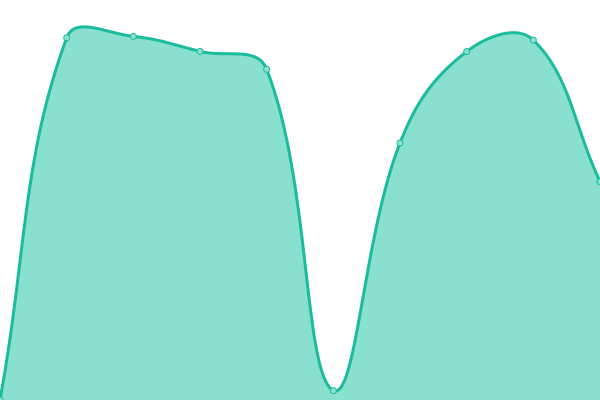
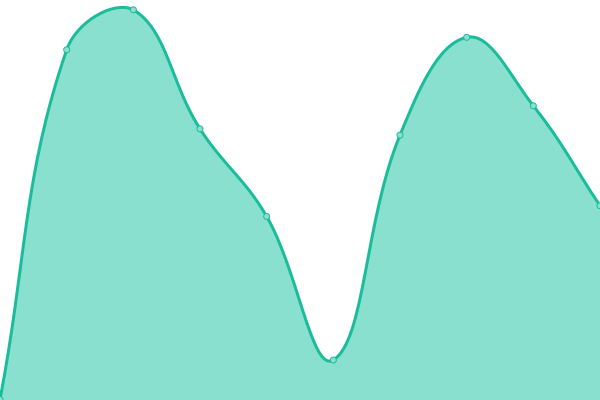
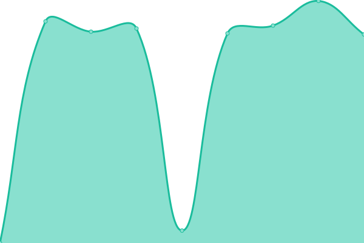

# [📈 Live Status](https://status.scrl.io): <!--live status--> **🟩 All systems operational**

This repository contains the open-source uptime monitor and status page for [SCRL](scrl.io), powered by [Upptime](https://github.com/upptime/upptime).

With [Upptime](https://upptime.js.org), you can get your own unlimited and free uptime monitor and status page, powered entirely by a GitHub repository. We use [Issues](https://github.com/SECURI-Cybersecurity-Audit-KYC/status/issues) as incident reports, [Actions](https://github.com/SECURI-Cybersecurity-Audit-KYC/status/actions) as uptime monitors, and [Pages](https://status.scrl.io) for the status page.

<!--start: status pages-->
<!-- This summary is generated by Upptime (https://github.com/upptime/upptime) -->
<!-- Do not edit this manually, your changes will be overwritten -->
<!-- prettier-ignore -->
| URL | Status | History | Response Time | Uptime |
| --- | ------ | ------- | ------------- | ------ |
|  [SCRL Website](https://scrl.io) | 🟩 Up | [scrl-website.yml](https://github.com/SECURI-Cybersecurity-Audit-KYC/status/commits/HEAD/history/scrl-website.yml) | 

 2653ms
     
 | 

<a href="https://status.scrl.io/history/scrl-website">99.85%</a>
    

|  [SCRL Live Chat Support](https://chat.scrl.io) | 🟩 Up | [scrl-live-chat-support.yml](https://github.com/SECURI-Cybersecurity-Audit-KYC/status/commits/HEAD/history/scrl-live-chat-support.yml) | 

 854ms
     
 | 

<a href="https://status.scrl.io/history/scrl-live-chat-support">97.94%</a>
    

|  [Email Support Ticket](https://support.scrl.io) | 🟩 Up | [email-support-ticket.yml](https://github.com/SECURI-Cybersecurity-Audit-KYC/status/commits/HEAD/history/email-support-ticket.yml) | 

 594ms
     
 | 

<a href="https://status.scrl.io/history/email-support-ticket">99.85%</a>
    

|  [Request Service Form & Incident Report Form](https://survey.scrl.io) | 🟩 Up | [request-service-form-and-incident-report-form.yml](https://github.com/SECURI-Cybersecurity-Audit-KYC/status/commits/HEAD/history/request-service-form-and-incident-report-form.yml) | 

 1533ms
     
 | 

<a href="https://status.scrl.io/history/request-service-form-and-incident-report-form">97.94%</a>
    

|  [KYC System](https://kyc.scrl.io) | 🟩 Up | [kyc-system.yml](https://github.com/SECURI-Cybersecurity-Audit-KYC/status/commits/HEAD/history/kyc-system.yml) | 

 2595ms
     
 | 

<a href="https://status.scrl.io/history/kyc-system">100.00%</a>
    

|  [Document Signature System](https://signdoc.scrl.io) | 🟩 Up | [document-signature-system.yml](https://github.com/SECURI-Cybersecurity-Audit-KYC/status/commits/HEAD/history/document-signature-system.yml) | 

 1076ms
     
 | 

<a href="https://status.scrl.io/history/document-signature-system">97.94%</a>
    

<!--end: status pages-->

[**Visit our status website →**](https://status.scrl.io)

## 📄 License

- Powered by: [Upptime](https://github.com/upptime/upptime)
- Code: [MIT](./LICENSE) © [Anand Chowdhary](https://anandchowdhary.com), supported by [Pabio](https://pabio.com)
- Data in the `./history` directory: [Open Database License](https://opendatacommons.org/licenses/odbl/1-0/)
